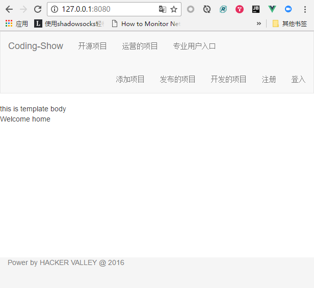
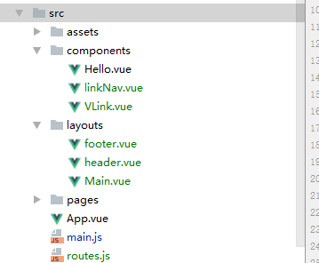

# coding-show-frontend

> Coding-Show 前端部分

## 截图
npm run dev 截图

显示模板文件结构

拆分页面部分，创建组建、布局、页面，进行拼接

## 待解决问题

已引入 bootstrap.min.css, 引入bootstrap.min.js 出错！

## 编译安装

``` bash
# 安装依赖
npm install

# 启动服务在 localhost:8080
npm run dev

# build for production with minification
npm run build

# run unit tests
npm run unit

# run e2e tests
npm run e2e

# run all tests
npm test
```

For detailed explanation on how things work, checkout the [guide](http://vuejs-templates.github.io/webpack/) and [docs for vue-loader](http://vuejs.github.io/vue-loader).
